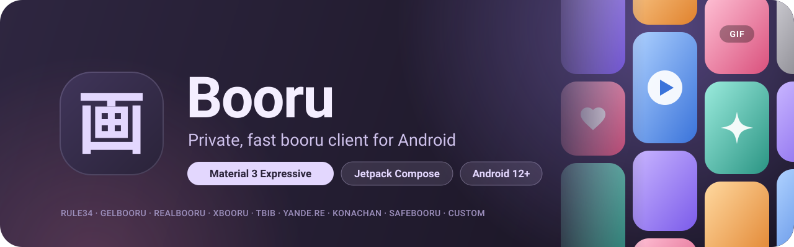

  

  
  
  

<table>
  <tr>
    <td></td>
    <td></td>
    <td></td>
    <td></td>
  </tr>
</table>

## Features

- **Sources:** Rule34, Gelbooru, Realbooru, Xbooru, TBIB, Yande.re, Konachan, Safebooru. You can also add any custom Gelbooru, Moebooru or Danbooru instance.
- **For you feed:** posts from all enabled sources in one feed, with recommendations learned on the device from your favorites. A slider sets the mix between new posts and recommendations. Each source can be turned on or off.
- **Search:** multiple tags at once, autocomplete that shows tag categories and post counts, and search history.
- **Filters:** content type (photos, videos, GIFs), rating, hide AI-generated posts. Sort by newest, top score or random.
- **Tag blacklist:** applied to every source.
- **Viewer:**
  - zoom and swipe-to-dismiss in fullscreen;
  - tags with quick actions;
  - download the original, share, set as wallpaper, open in browser.
- **Video:** downloads in parallel chunks, so seeking is instant. Playback speed from 0.5x to 2x.
- **Favorites:** stored offline, with folders, search by tag and filters by type.
- **Material 3 Expressive design:** eight color palettes including Monet dynamic color, light, dark and AMOLED modes. Tablets and foldables get a navigation rail.
- **Languages:** English, Russian, Japanese, Chinese, Korean, Arabic.
- **Privacy:**
  - no analytics or accounts;
  - API keys stored encrypted;
  - biometric app lock;
  - incognito mode;
  - content hidden from recents and screenshots.
- **Updates:** built-in updater from GitHub Releases that checks the APK signature before installing.

## License

[GPL-3.0](LICENSE)
